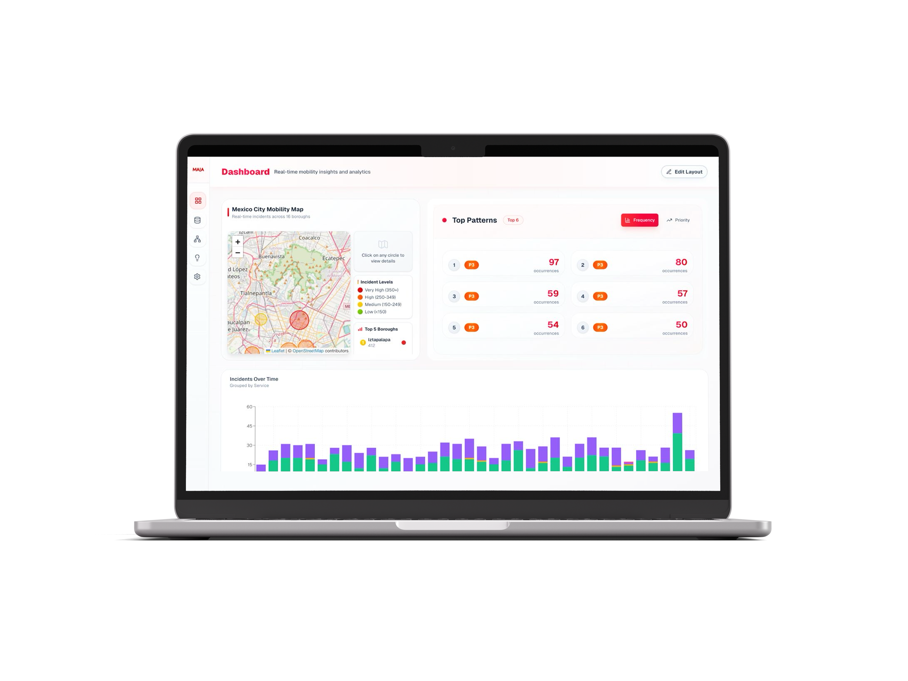

# MAIA - Mobility AI Analytics 🚦

[](https://nextjs.org/)
[](https://supabase.com/)
[](https://www.typescriptlang.org/)
[](https://groq.com/)
[](https://tailwindcss.com)
[](https://vercel.com/)

> An AI-powered mobility analytics platform that transforms how cities understand and resolve transportation challenges. By turning scattered user feedback into actionable insights, MAIA empowers authorities to make data-driven decisions that directly improve system reliability.

---

## What is MAIA?

**MAIA** is a comprehensive intelligence platform designed to bridge the gap between riders and transportation authorities. It intelligently scrapes incidents from social media and correlates them with internal reports to capture issues that often go unnoticed.

The system uses advanced pattern recognition to identify root causes of transportation failures and doesn't just stop at detection—it **proposes three tailored solutions** (at different budget levels) for each identified pattern, complete with impact projections and feasibility assessments.

---

## Key Features

- **Multi-Channel Intelligence:** Automatically aggregates data from social media (Twitter/X) and internal incident reports.
- **AI Pattern Recognition:** utilizes Groq API and local embeddings to cluster scattered incidents into clear, actionable problem patterns.
- **Smart Solution Generation:** automatically proposes 3 distinct solutions for every problem pattern based on severity and budget constraints.
- **Real-Time Visualization:** Interactive dashboard for monitoring mobility health and emerging trends.
- **Rich Data Enrichment:** Automatically tags data with severity assessments, keyword extraction, and intelligent summaries.
- **RESTful API Architecture:** Robust endpoints for external data processing and management.

---

## Screenshots

### Dashboard Analytics


### Pattern Recognition & Clustering


### AI Solution Proposals


---

## Prerequisites

- **Node.js 18+** and **npm**
- **Supabase Account** (for Database & Auth)
- **Groq API Key** (for AI analysis features)
- **Twitter API Key** (optional, for live scraping)

---

## Quickstart ⚡️

### 1. Clone the repository

```bash
git clone [https://github.com/JorgeVenegas/zepedapp.git](https://github.com/JorgeVenegas/zepedapp.git)
cd zepedapp
